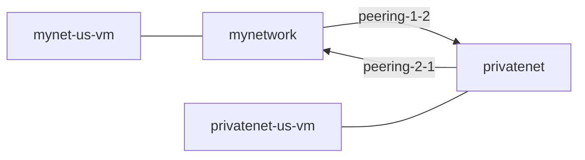
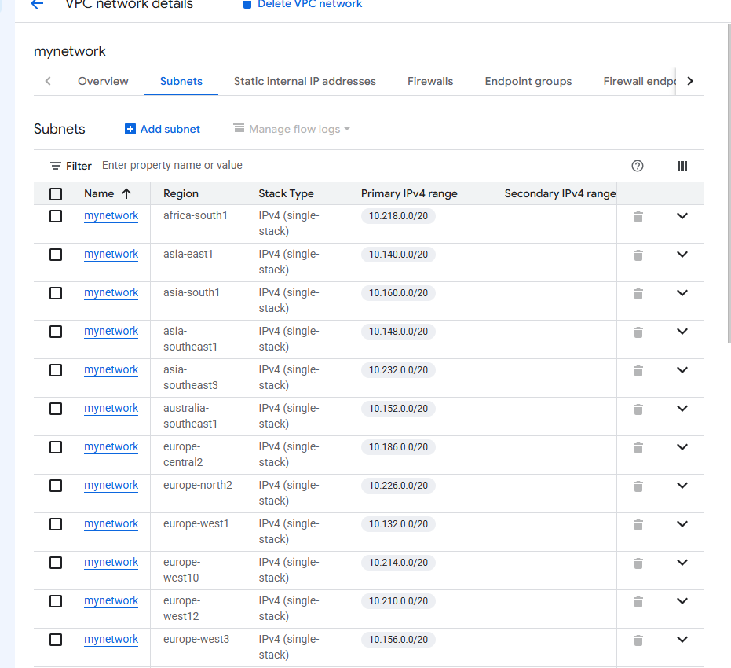
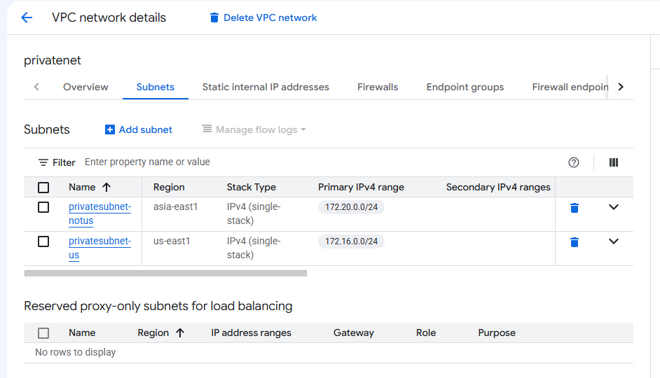
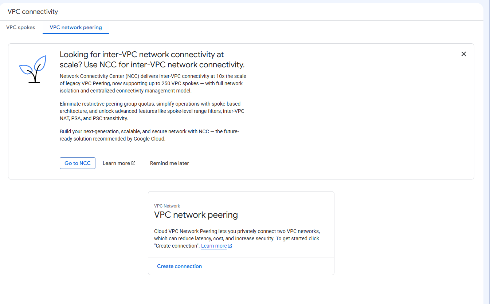
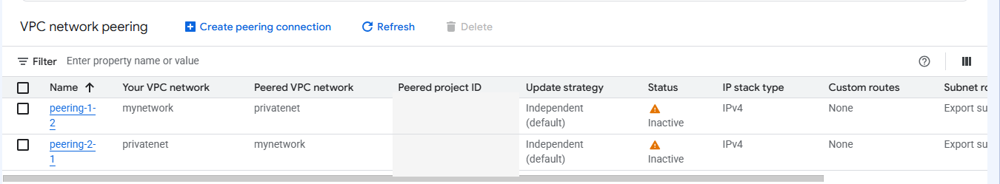
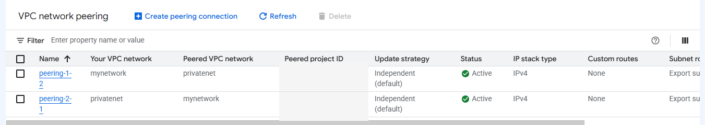
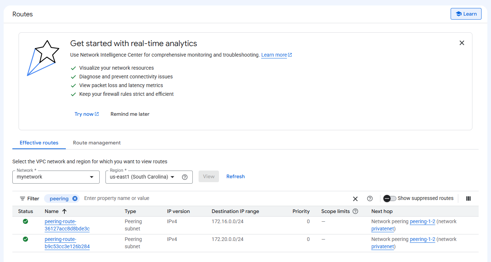
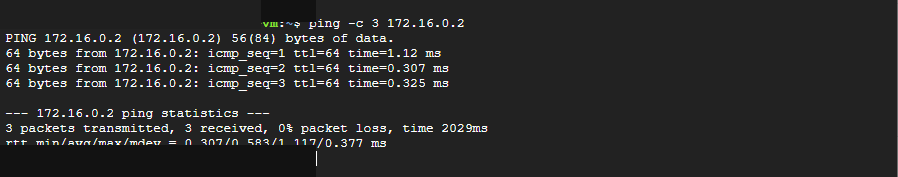
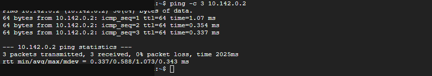

# Google Cloud VPC Network Peering Lab

Hands-on Google Cloud lab where I checked VPC address ranges, created a peering relationship between two networks, verified the new routes, tested private IP connectivity in both directions, and checked how internal DNS behaved across the peering.

> **Note:** This was a Google Cloud Skills Boost training lab. It was done for hands-on practice and is not a production environment.

## What I Practiced

- Checking subnet ranges before peering two VPCs
- Creating both sides of a VPC peering relationship
- Watching the peering move from inactive to active
- Verifying routes created by VPC peering
- Testing private IP connectivity between separate VPCs
- Testing the return path in the opposite direction
- Seeing the difference between working IP connectivity and DNS resolution

## Lab Flow



---

## 1. Check the VPC Subnet Ranges

Before setting up peering, I checked the subnet ranges for `mynetwork` and `privatenet`.

`mynetwork` used addresses from the `10.x.x.x` range.



`privatenet` had two subnets:

- `privatesubnet-us` — `172.16.0.0/24`
- `privatesubnet-notus` — `172.20.0.0/24`



The address ranges did not overlap.

### What I Learned

Before two VPCs can be peered, their subnet ranges have to be separate. If the networks use overlapping address space, the same IP range could exist on both sides.

### Why It Mattered

This was the first thing I needed to check before connecting the networks. Good IP planning matters because overlapping address space can prevent networks from being peered later.

---

## 2. Configure VPC Network Peering

I created the peering relationship in both directions:

- `peering-1-2`: `mynetwork` → `privatenet`
- `peering-2-1`: `privatenet` → `mynetwork`

Before the connection existed, the VPC Network Peering page had no active peerings.



After I created both entries, they initially appeared as inactive while Google Cloud updated the connection state.



After refreshing the page, both peerings changed to **Active**.



### What I Learned

Each VPC keeps its own side of the peering configuration. Both sides have to exist and match before the peering relationship becomes active.

### Why It Mattered

Creating one side by itself was not enough. Once both sides matched and became active, the networks were ready to exchange private traffic.

---

## 3. Verify the Peering Routes

After the peering became active, I checked the routes for `mynetwork`.

Google Cloud added routes for the `privatenet` subnet ranges:

- `172.16.0.0/24`
- `172.20.0.0/24`

Both routes showed `peering-1-2` as the next hop.



### What I Learned

Once VPC peering becomes active, Google Cloud adds routes that let each network reach the subnet ranges in the other VPC.

### Why It Mattered

The peering status is only part of the story. The routes are what actually give traffic a path to the private IP ranges on the other side.

---

## 4. Test Private Connectivity from `mynetwork` to `privatenet`

From `mynet-us-vm`, I pinged the internal IP address of `privatenet-us-vm`.

The ping succeeded with all three packets received and `0% packet loss`.



### What I Learned

Once the peering was active, `mynet-us-vm` could reach `privatenet-us-vm` using its internal IP address.

### Why It Mattered

This confirmed that the two VPCs had working private connectivity without needing to use the VM's external IP address.

---

## 5. Test Private Connectivity in the Other Direction

I connected to `privatenet-us-vm` and pinged the internal IP address of `mynet-us-vm`.

The return ping also succeeded with `0% packet loss`.



### What I Learned

The peering connection allowed private communication between the two VPCs in both directions.

### Why It Mattered

Testing the return path helped confirm that the connection was working both ways, not just from `mynetwork` to `privatenet`.

---

## 6. Test Internal DNS Across the Peering

From `privatenet-us-vm`, I tried to reach `mynet-us-vm` by hostname instead of its internal IP address.

The hostname lookup failed with:

```text
ping: mynet-us-vm: Name or service not known
```


### What I Learned

VPC peering gave the networks a working private IP path, but it did not automatically make the Compute Engine internal DNS name available across the peering connection.

### Why It Mattered

This was a good reminder that IP connectivity and DNS resolution are separate things. A VM can be reachable by IP even when its hostname does not resolve.

---

## Key Takeaways

- Subnet ranges need to be checked before peering VPCs.
- VPC peering is configured from both networks.
- Both sides must match before the connection becomes active.
- Google Cloud adds peering routes for the remote subnet ranges.
- Private IP traffic can move between the peered VPCs once the routes are in place.
- Testing both directions helped confirm that private connectivity was working as expected.
- Working private IP connectivity does not automatically mean internal DNS names will resolve across the peering.

## Tools and Technologies

`Google Cloud` · `VPC Network Peering` · `Compute Engine` · `Routes` · `RFC 1918` · `ICMP` · `SSH` · `CIDR` · `Internal DNS`

## Detailed Notes

My fuller task-by-task notes are in [`docs/lab-notes.md`](docs/lab-notes.md).

## Disclaimer

This repository documents a Google Cloud Skills Boost training lab completed for learning and professional development. The resources were temporary and do not represent a production deployment. No employer, customer, or production data is included.
